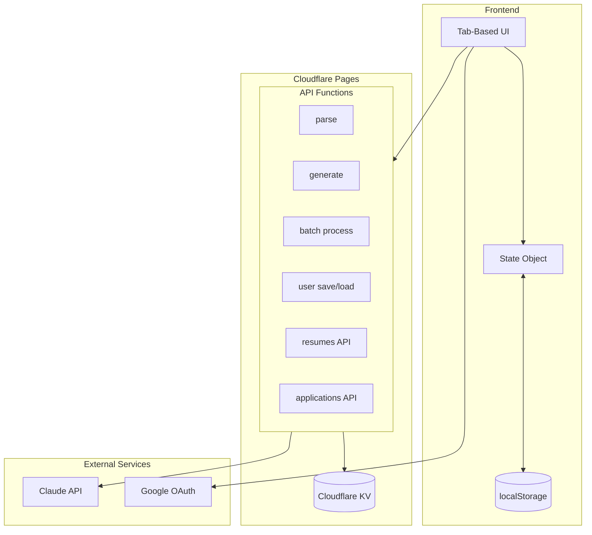
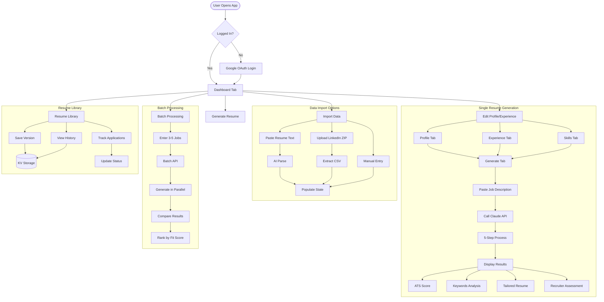

# Claude Resume

AI-Powered ATS Resume Builder that tailors your resume for every job application.


## Features

- **AI Resume Tailoring** - Automatically customizes your resume for each job description
- **ATS Optimization** - Ensures your resume passes Applicant Tracking Systems
- **Batch Processing** - Compare your fit across 3-5 jobs simultaneously
- **Resume Library** - Save and manage multiple resume versions
- **Application Tracking** - Track status (Applied → Interviewing → Offered)
- **LinkedIn Import** - Import your profile data from LinkedIn export
- **Recruiter Assessment** - Get AI feedback from a recruiter's perspective

## Architecture



## User Workflow



## 5-Step Resume Generation Process


## Tech Stack

| Component | Technology |
|-----------|------------|
| Frontend | Vanilla HTML/CSS/JS (single file) |
| Hosting | Cloudflare Pages |
| API | Cloudflare Workers (Functions) |
| Storage | Cloudflare KV |
| AI | Claude API (claude-3-5-sonnet) |
| Auth | Google OAuth |

## API Endpoints

| Endpoint | Method | Purpose |
|----------|--------|---------|
| `/api/parse` | POST | Parse resume text to structured data |
| `/api/generate` | POST | Generate tailored resume (single job) |
| `/api/user/save` | POST | Save user profile data |
| `/api/user/load` | GET | Load user profile data |
| `/api/batch/process` | POST | Process multiple jobs in parallel |
| `/api/resumes/save` | POST | Save resume version to library |
| `/api/resumes/list` | GET/POST | List or get single resume |
| `/api/resumes/delete` | POST | Delete saved resume |
| `/api/applications/update` | POST | Update application status/notes |

## Setup

### 1. Clone and install

```bash
git clone https://github.com/mitchhall16/claude-resume.git
cd claude-resume
```

### 2. Create KV namespace

```bash
wrangler kv namespace create RESUME_DATA
# Copy the ID to wrangler.toml
```

### 3. Set API key

```bash
wrangler pages secret put ANTHROPIC_API_KEY --project=claude-resume
```

### 4. Deploy

```bash
wrangler pages deploy . --project-name=claude-resume
```

## LinkedIn Data Import

To import your LinkedIn data:

1. Go to **LinkedIn → Settings → Data Privacy**
2. Click **Get a copy of your data**
3. Select **"Download larger data archive"** (not the fast basic one)
4. Wait for email (10 min - 24 hours)
5. Upload the ZIP file in the app

The full export includes: `Profile.csv`, `Positions.csv`, `Education.csv`, `Skills.csv`

## Skill Package

This project includes a portable skill package (`skill/`) following Anthropic's framework:

```
skill/
├── SKILL.md                    # Main skill instructions
├── references/
│   ├── ats-optimization.md     # ATS keyword strategies
│   ├── recruiter-patterns.md   # What recruiters look for
│   └── bullet-formulas.md      # Achievement bullet templates
└── scripts/
    └── score_resume.py         # ATS scoring algorithm
```

Can be used with Claude Desktop or Claude.ai Projects.

## License

MIT
